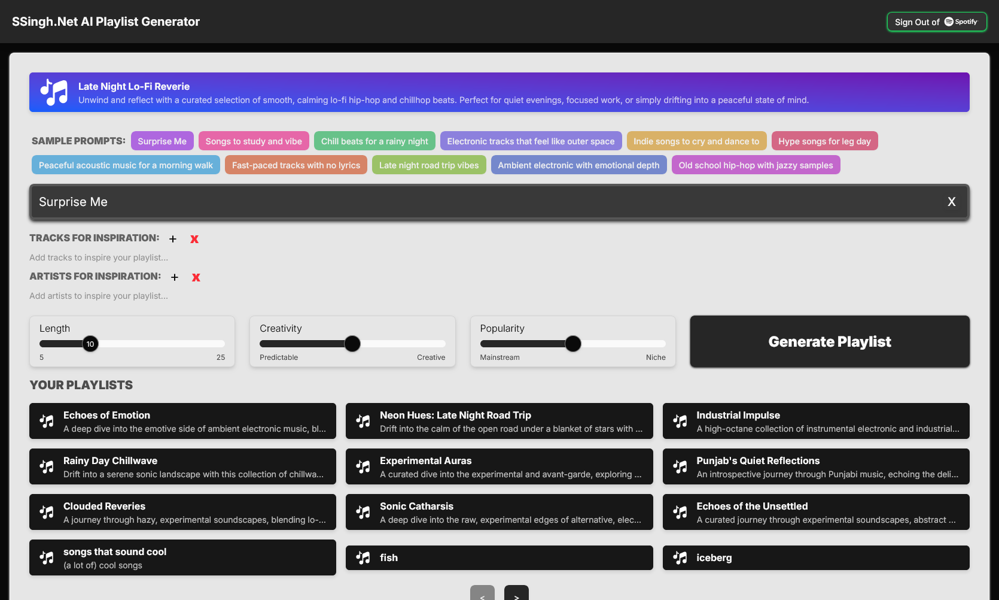

# 🎧 AI Playlist Generator

**AI Playlist Generator** is a full-stack, AI-powered music web application that generates custom Spotify playlists from natural language prompts. Leveraging **Gemini 2.5** via **Spring AI**, it interprets user intent and creates curated playlists through Spotify's API.

🌐 **Live App**: [aiplaylist.ssingh.net](http://aiplaylist.ssingh.net)

---

## 🖼️ Screenshot 

---

## 🛠️ Tech Stack

### Frontend
- **Framework**: Next.js (React) with TypeScript  
- **Styling**: Tailwind CSS, ShadCN
- **Deployment**: Vercel  

### Backend (Spring Boot Microservices)
- `api-gateway`: Routes and exposes backend endpoints  
- `llm-service`: Integrates **Gemini 2.5** via **Spring AI**  
- `spotify-service`: Handles Spotify API operations  
- `service-registry`: **Eureka Server** for service discovery  

### Cloud & DevOps
- **Dockerized** microservices  
- **AWS ECS (Fargate)** for serverless container hosting  
- **Application Load Balancer (ALB)** for external traffic routing  
- **Only the API Gateway** is exposed — all other services are internal  

---

## 🌟 Features

- **🎧 AI-Generated Playlists**  
  Input natural language prompts like _"hype music for lifting"_ and get a fresh playlist.

- **🎵 Seamless Spotify Integration**  
  Log in with your Spotify account and instantly save generated playlists.

- **☁️ Cloud-Native Architecture**  
  Each microservice is containerized and deployed independently on **ECS Fargate**.

- **🔐 Secure Gateway Access Only**  
  All user traffic goes through the **API Gateway**, while internal services are discoverable via **Eureka**.

- **🧠 LLM-Driven Music Curation**  
  Uses **Gemini 2.5** through **Spring AI** for prompt analysis and genre inference.

